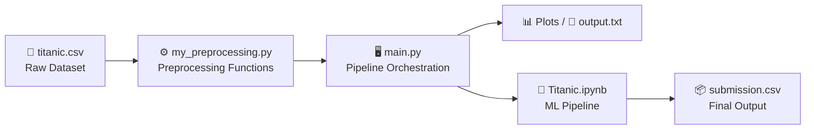

# Titanic Preprocessing & ML Pipeline

## 🚀 Key Components and Data Flow

The system's **modular design** centers around the `my_preprocessing.py` function library, which provides reusable preprocessing operations orchestrated by `main.py` for **batch processing** or imported directly for **interactive use**.

| 🧩 **Component**           | 🎯 **Purpose**                  | 🛠 **Key Functions**                              | 📦 **Output Artifacts**      |
|----------------------------|---------------------------------|---------------------------------------------------|------------------------------|
| 📄 `titanic.csv`           | Raw dataset                     | Data source                                       | 891 passenger records        |
| ⚙️ `my_preprocessing.py`   | Function library                 | `read_data`, `check_types`, `visual`, `encode_columns` | Reusable preprocessing       |
| 🖥 `main.py`                | Pipeline orchestrator            | Workflow coordination, logging                    | `output.txt`, `plots/`       |
| 📓 `Titanic.ipynb`         | Complete ML pipeline             | End-to-end analysis                               | `submission.csv`             |

---

### 🔍 Data Quality and Transformation Pipeline
This section covers **data validation**, **cleaning**, and **feature transformation** to ensure consistent, high-quality inputs for the ML model.

---

## 📊 Data Flow Diagram

ص